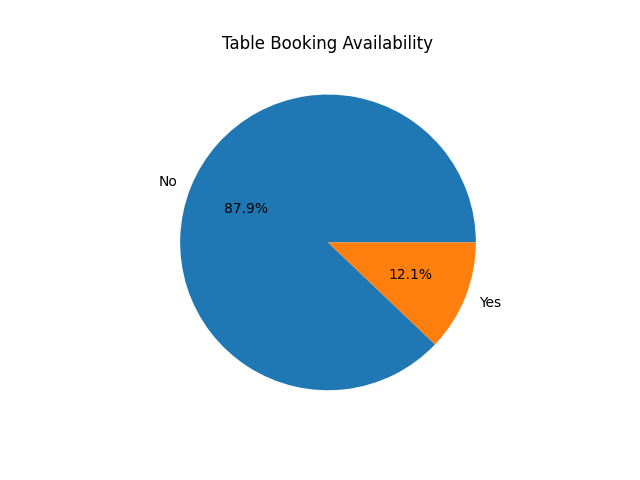

# COGNIFYZ - DATA ANALYSIS LEVEL 2 TASK 1

## 📌 Project Overview
This project focuses on analyzing table booking availability among restaurants. The analysis helps understand how many restaurants provide reservation facilities and customer convenience services.

---

## 🛠 Tools & Technologies Used
- Python
- Pandas
- Matplotlib

---

## 🎯 Objective
The objectives of this task are:
- Analyze restaurant table booking availability
- Calculate booking distribution percentages
- Visualize booking facilities using charts
- Understand customer service trends

---

## 📂 Dataset Description
The dataset contains restaurant information including:
- Restaurant names
- Table booking availability
- Online delivery services
- Ratings
- Price ranges
- Cuisine types

---

## ⚙️ Steps Performed
1. Loaded dataset using pandas
2. Counted restaurants offering table booking
3. Calculated percentage distribution
4. Created pie chart visualization
5. Analyzed customer convenience services

---

## 📊 Data Visualization

### 🔹 Table Booking Distribution

---

## 🔍 Key Insights
- Most restaurants do not provide table booking facilities
- Only a smaller percentage offers reservations
- Restaurants with booking systems may improve customer experience
- Reservation services can support better crowd management

---

## 📈 Business Recommendations
- Restaurants can introduce table booking systems
- Online reservation features improve customer convenience
- Businesses can use booking systems for better management

---

## ✅ Conclusion
Table booking analysis helps understand restaurant service quality and customer convenience trends. Restaurants offering booking facilities may provide better dining experiences.